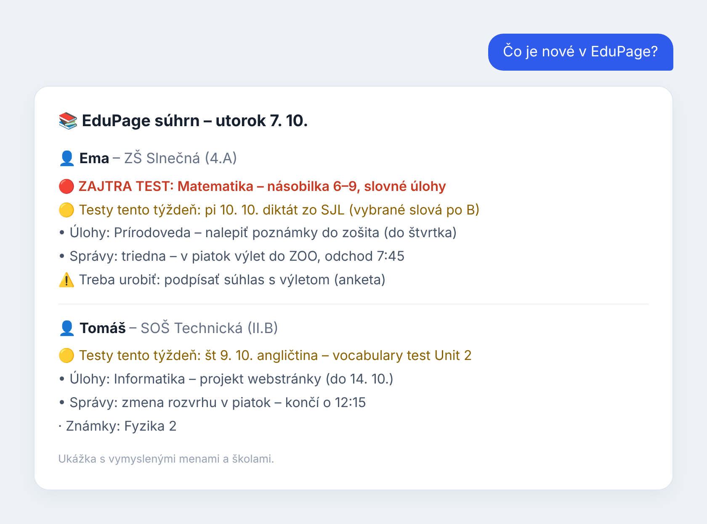
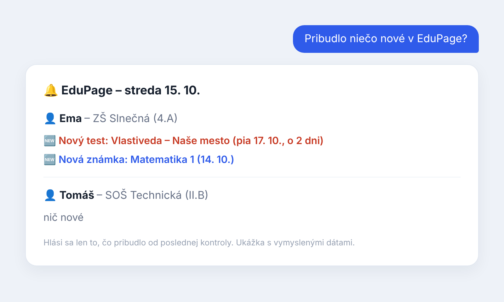

# EduPage skills pre Claude

> **Pre rodičov / for parents:** jednoduchý návod je v [docs/pre-rodicov.md](docs/pre-rodicov.md) · [English](docs/pre-rodicov.en.md) · [Čeština](docs/pre-rodicov.cs.md)

Tri skills pre rodičov: **edupage-reader** (prehľad, testy, ospravedlnenky), **edupage-report** (súhrnné reporty a stránka triedy) a **edupage-notify** (upozornenia na nové známky a testy). Celý obsah: [CONTENTS.md](CONTENTS.md).

Skill, ktorý z rodičovského účtu v [EduPage](https://www.edupage.org) vytiahne to dôležité: **najbližšie testy a písomky**, domáce úlohy, rozvrh, správy od učiteľov a akcie školy. Funguje pre viac detí, aj keď každé chodí na inú školu.

Claude číta EduPage cez **Claude in Chrome** v tvojom prihlásenom prehliadači. Do EduPage sa prihlasuješ sám, Claude heslo nikdy nepýta ani nevidí a nič neodošle (ospravedlnenka, odpoveď učiteľke…) bez tvojho výslovného „áno“. Keď nie si pri počítači, stačí mu poslať screenshot z EduPage appky alebo fotku oznamu zo školy.



### Ako číta EduPage

Claude otvorí EduPage v tvojom Chrome, kde si prihlásený, a v tej karte spustí krátky skript ([`collect.js`](plugins/edupage/skills/edupage-reader/scripts/collect.js)). Ten si vypýta tie isté dáta, z ktorých sa skladajú stránky EduPage – testy, DÚ, správy, rozvrh, známky – len ich nečaká vykresliť. Je to rýchlejšie a presnejšie než klikanie a screenshoty.

- len čítanie, s tvojím prihlásením v prehliadači – heslo Claude nepotrebuje ani nevidí,
- dáta neodchádzajú nikam inam, len do tvojho chatu,
- keď EduPage niečo zmení alebo ťa odhlási, Claude prejde na klasické klikanie po stránkach a povie ti to,
- odosielanie (ospravedlnenka, odpoveď učiteľke) ide vždy cez stránku a až po tvojom „áno“.

## Čo vie

- 🔴/🟡 testy a písomky navrchu, aj tie ohlásené len v správe učiteľky
- denný / týždenný súhrn za každé dieťa zvlášť
- „čo má zajtra?“, „kedy končí?“ z rozvrhu
- kalendár akcií a prázdnin, export do `.ics`
- ospravedlnenky, odhlásenie obeda, odpovede na správy (vždy s potvrdením)
- viac detí a viac škôl na jednom EduPage konte (prepínanie bez hesla), počet detí nie je obmedzený
- odpovedá v jazyku, v akom sa pýtaš (slovensky, česky, anglicky…)
- **z mobilu bez počítača:** prehľad zo screenshotov EduPage appky alebo fotiek papierových oznamov (žiacka knižka, list zo školy, zošit)
- prvé spustenie bez hesla: nájde školu, ty sa prihlásiš v Chrome, deti a školy si zistí sám

## Súhrnné reporty (edupage-report)

- **Rodinný report** – týždenný alebo mesačný, za každé dieťa zvlášť: testy s odpočtom, napísané testy, DÚ, akcie, dochádzka, voliteľne známky a na konci zoznam „čo treba urobiť“.
- **Stránka triedy** – zdieľateľný prehľad pre spolužiakov: najbližší test s odpočtom dní, počítadlo pri každom teste, zoznam po týždňoch a sekcia „Už bolo“. Obsahuje len údaje triedy, nikdy známky, dochádzku ani mená a kontakty.

Príklady: „Sprav týždenný report pre obe deti“, „Daj testy a akcie 4.A na stránku“.

## Upozornenia na nové známky a testy (edupage-notify)

Sleduje EduPage a dá vedieť, **len keď niečo pribudne** — nová známka alebo novo ohlásený test. Pamätá si, čo už hlásil, takže neotravuje opakovane. Najlepšie ako naplánovaná úloha poobede cez pracovné dni: kontrola beží na tvojom počítači a upozornenie ti príde **ako notifikácia do mobilu**. Keď nie je nič nové, mlčí.

Príklady: „Upozorni ma, keď pribudne nová známka“, „Sleduj testy a daj vedieť večer predtým“.



## Pre viac rodičov / nasadenie

Toto je navrhnuté tak, aby si to **každý rodič nastavil sám** a videl len svoje EduPage — žiadne heslá si navzájom nedávate. Hotový jednostranový návod, ktorý môžeš poslať komukoľvek: **[docs/pre-rodicov.md](docs/pre-rodicov.md)** (aj [English](docs/pre-rodicov.en.md) a [Čeština](docs/pre-rodicov.cs.md)). Nápady do budúcna (vrátane možnej služby) sú v [ROADMAP.md](ROADMAP.md).

## Inštalácia

**Claude Code / Cowork (plugin):**

```
/plugin marketplace add sano77/edupage-skills
/plugin install edupage@edupage-skills
```

**Claude.ai / desktop app (skilly):** stiahni priečinky z `plugins/edupage/skills/` (`edupage-reader`, voliteľne `edupage-report` a `edupage-notify`), každý zabaľ do ZIP a nahraj v *Settings → Capabilities → Skills*.

Na čítanie EduPage potrebuješ počítač s rozšírením **Claude in Chrome** a byť v Chrome prihlásený do EduPage. Z mobilu môžeš písať, keď je počítač zapnutý; inak pošli screenshoty alebo fotky.

## Príklady

- „Čo je nové v EduPage?“
- „Aké testy majú deti tento týždeň?“
- „Čo má Janka zajtra?“
- „Napíš ospravedlnenku na piatok z rodinných dôvodov“
- *(fotka zo žiackej knižky)* „Čo z toho treba stihnúť tento týždeň?“

## Súkromie

Repozitár pri každom pushi kontroluje GitHub Actions (`scripts/privacy_check.py` + gitleaks): e-maily, telefóny, IBAN, rodné čísla, čísla OP, skutočné adresy škôl na EduPage, GPS v obrázkoch a súkromný zoznam slov uložený len ako kľúčované hashe.

Skill je napísaný po anglicky, aby ho mohli použiť rodičia kdekoľvek, ale odpovedá po slovensky, keď sa pýtaš po slovensky. Neobsahuje žiadne mená, školy ani prihlasovacie údaje – deti a školy si zistí z tvojho účtu pri prvom spustení. Údaje o deťoch zostávajú v tvojom chate.

---

## English

A Claude skill for parents using [EduPage](https://www.edupage.org) (common in Slovakia, Czechia and other countries). Through **Claude in Chrome** it reads your signed-in parent account and puts **upcoming tests first**, then homework, timetable, teacher messages and school events.

- any number of children, also at different schools on one account
- daily / weekly summary per child, "what's on tomorrow?", events calendar with `.ics` export
- absence excuses, cancelling lunch, replying to teachers – always shown first and sent only after your explicit "yes"
- a second skill, **edupage-report**, builds weekly/monthly family reports and a shareable class agenda page with a test countdown
- reads the data the EduPage pages are built from, inside your signed-in tab (fast, read-only, no password), with page clicking as a fallback
- answers in your language; you sign in yourself – it never asks for, sees or stores passwords, and keeps children's data in your chat
- **on your phone without a computer:** builds the same overview from screenshots of the EduPage app or photos of paper notices
- **edupage-notify** watches for new grades and newly announced tests and sends an alert to your phone only when something changed

Install in Claude Code / Cowork:

```
/plugin marketplace add sano77/edupage-skills
/plugin install edupage@edupage-skills
```

Try: *"What's new in EduPage?"*, *"Which tests do the kids have this week?"*, *"Excuse Friday's absence for family reasons."*

Neoficiálny projekt, nie je spojený so spoločnosťou asc Applied Software Consultants.

MIT License
